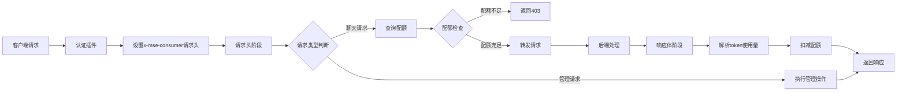
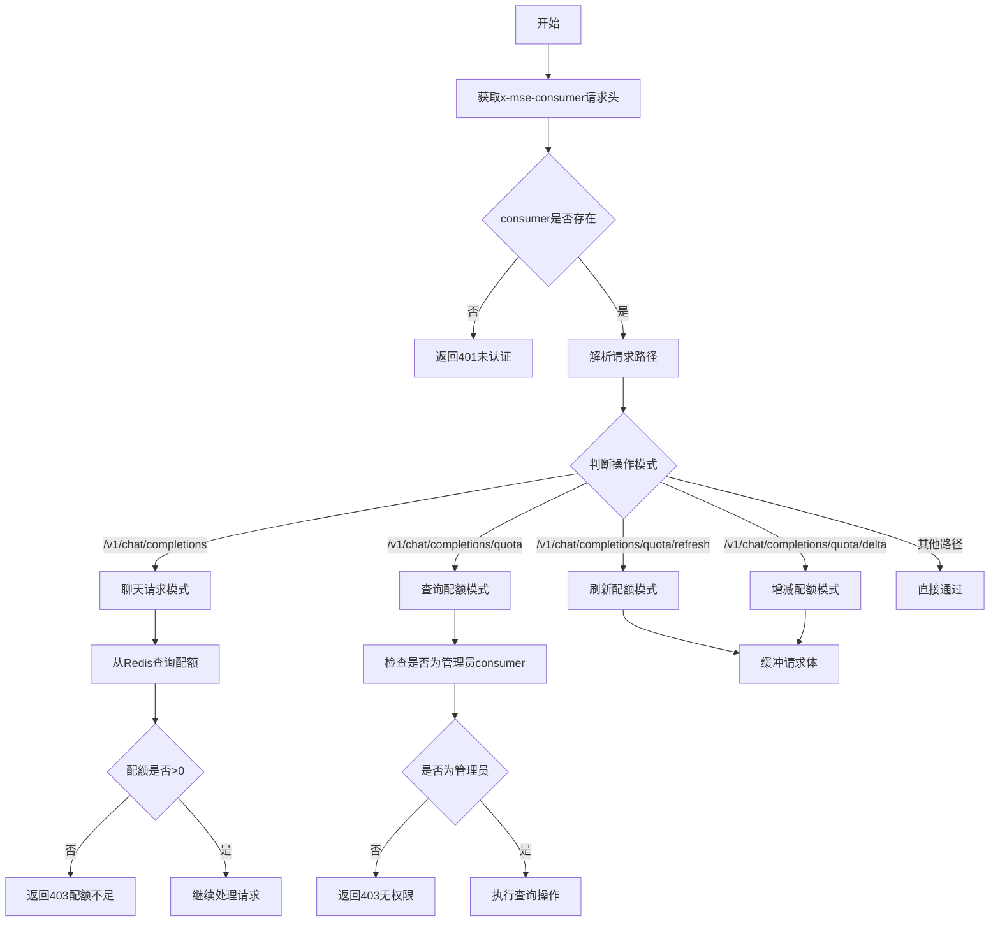
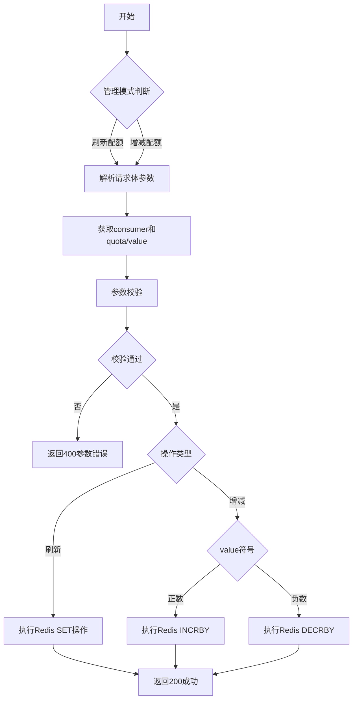
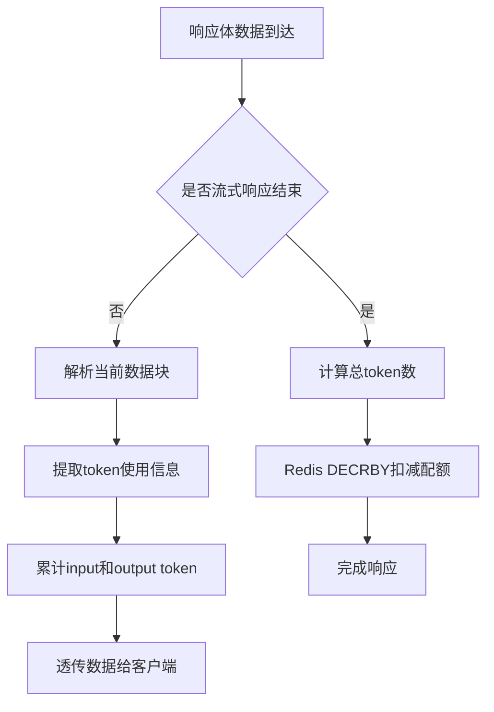
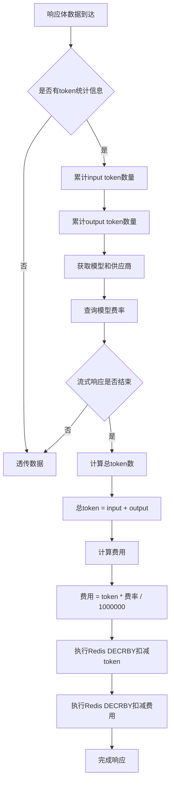

## 功能说明

`ai-quota` 插件实现给特定 consumer 根据分配固定的 quota 进行 quota 策略限流，同时支持 quota 管理能力，包括查询 quota 、刷新 quota、增减 quota。插件支持双重预算管理机制，可同时控制 token 用量和费用上限，支持按模型配置差异化费率。

`ai-quota` 插件需要配合 认证插件比如 `key-auth`、`jwt-auth` 等插件获取认证身份的 consumer 名称，同时需要配合 `ai-statistics` 插件获取 AI Token 统计信息。

## 运行属性

插件执行阶段：`默认阶段`
插件执行优先级：`750`

## 配置说明

| 名称                 | 数据类型            | 填写要求                                 | 默认值 | 描述                                         |
|--------------------|-----------------|--------------------------------------| ---- |--------------------------------------------|
| `redis_key_prefix` | string          |  选填                                     |   chat_quota:   | qutoa redis key 前缀                         |
| `admin_consumer`   | string          | 必填                                   |      | 管理 quota 管理身份的 consumer 名称                 |
| `admin_path`       | string          | 选填                                   |   /quota   | 管理 quota 请求 path 前缀                        |
| `precision`        | int             | 选填                                   |   9   | 金额精度，默认为 9（纳元级别）                         |
| `redis`            | object          | 是                                    |      | redis相关配置                                  |

`redis`中每一项的配置字段说明

| 配置项       | 类型   | 必填 | 默认值                                                     | 说明                                                                                         |
| ------------ | ------ | ---- | ---------------------------------------------------------- | ---------------------------                                                                  |
| service_name | string | 必填 | -                                                          | redis 服务名称，带服务类型的完整 FQDN 名称，例如 my-redis.dns、redis.my-ns.svc.cluster.local |
| service_port | int    | 否   | 服务类型为固定地址（static service）默认值为80，其他为6379 | 输入redis服务的服务端口                                                                      |
| username     | string | 否   | -                                                          | redis用户名                                                                                  |
| password     | string | 否   | -                                                          | redis密码                                                                                    |
| timeout      | int    | 否   | 1000                                                       | redis连接超时时间，单位毫秒                                                                  |
| database     | int    | 否   | 0                                                          | 使用的数据库id，例如配置为1，对应`SELECT 1`                                                  |


## 配置示例

### 识别请求参数 apikey，进行区别限流
```yaml
redis_key_prefix: "chat_quota:"
admin_consumer: consumer3
admin_path: /quota
redis:
  service_name: redis-service.default.svc.cluster.local
  service_port: 6379
  timeout: 2000
```


###  刷新预算

如果当前请求 url 的后缀符合 admin_path，例如插件在 example.com/v1/chat/completions 这个路由上生效，那么更新预算可以通过
curl https://example.com/v1/chat/completions/quota/refresh -H "Authorization: Bearer credential3" -d "consumer=consumer1&token_budget=10000&cost_budget=100.0"

Redis 中 key 为 chat_quota:token_budget:consumer1 的值就会被刷新为 10000，chat_quota:cost_budget:consumer1 的值会被设置为 100000000000（纳元精度）

### 查询预算

查询特定用户的预算可以通过 curl https://example.com/v1/chat/completions/quota?consumer=consumer1 -H "Authorization: Bearer credential3"
将返回： {"consumer": "consumer1", "token_budget": 10000, "cost_budget": 100.000000000}

### 增减预算

增减特定用户的预算可以通过 curl https://example.com/v1/chat/completions/quota/delta -d "consumer=consumer1&token_budget_delta=100&cost_budget_delta=1.0" -H "Authorization: Bearer credential3"
这样 Redis 中 Key 为 chat_quota:token_budget:consumer1 的值就会增加 100，chat_quota:cost_budget:consumer1 的值就会增加 1000000000（纳元）。可以支持负数，则减去对应值。

### 设置费率

设定模型计费费率可通过
curl https://example.com/v1/chat/completions/quota/setrate -H "Authorization: Bearer credential3" -d "provider=openai&model=gpt-4&input_rate=30.0&output_rate=60.0"

**注意**: 不再支持默认费率配置。必须指定 provider 和 model 进行设置。
费率单位为元/百万token,内部以纳元精度存储

### 查询费率

查询模型费率可通过
curl https://example.com/v1/chat/completions/quota/getrate -H "Authorization: Bearer credential3" -d "provider=openai&model=gpt-4"
将返回： {"provider": "openai", "model": "gpt-4", "input_rate": 30.000000000, "output_rate": 60.000000000}

**注意**: 不再支持默认费率查询。必须指定 provider 和 model 进行查询。如果模型费率不存在，将返回零费率（成本为0，只扣除token）。

## 设计逻辑

### 架构概述

ai-quota 插件是一个基于 Proxy-WASM 的网关插件，用于对 AI 请求进行配额管理。该插件采用 **请求前检查 + 响应后扣减** 的设计模式，确保每个 consumer 的 token 使用量在配额范围内。

### 整体工作流程



### 请求头阶段处理流程



**关键设计点：**
- **异步查询**：使用 Redis 异步查询，避免阻塞请求处理
- **提前拦截**：在请求转发前就检查配额，避免无效请求消耗后端资源
- **路径路由**：通过 URL 后缀区分不同操作类型

### 请求体阶段处理流程（管理请求）



### 响应体阶段处理流程（聊天请求）



**关键设计点：**
- **流式处理**：支持流式响应的实时 token 统计
- **精确扣减**：根据实际的 input + output token 总量进行扣减
- **依赖 ai-statistics**：依赖 ai-statistics 插件提供的 token 解析能力

### 操作模式定义

插件通过 URL 路径后缀识别不同操作：

| 操作类型 | URL 路径 | 描述 |
|---------|----------|------|
| 聊天请求 | `/v1/chat/completions` | AI 聊天请求，需要双重预算检查和扣减 |
| 查询预算 | `/v1/chat/completions/quota?consumer=xxx` | 查询指定 consumer 的 token 和费用预算 |
| 刷新预算 | `/v1/chat/completions/quota/refresh` | 刷新指定 consumer 的 token 和费用预算 |
| 增减预算 | `/v1/chat/completions/quota/delta` | 增减指定 consumer 的 token 和费用预算 |
| 设置费率 | `/v1/chat/completions/quota/setrate` | 设置模型计费费率（默认或指定模型） |
| 查询费率 | `/v1/chat/completions/quota/getrate` | 查询模型计费费率（默认或指定模型） |

### 数据模型

#### Redis Key 设计
- **格式**:
  - `{redis_key_prefix}token_budget:{consumer}` - token 预算
  - `{redis_key_prefix}cost_budget:{consumer}` - 费用预算
  - `{redis_key_prefix}rate:default` - 默认费率配置
  - `{redis_key_prefix}rate:model:{provider}:{model_name}` - 模型费率配置
- **示例**: `chat_quota:token_budget:consumer1`, `chat_quota:cost_budget:consumer1`, `chat_quota:rate:model:openai:gpt-4`
- **值类型**:
  - token_budget：整数
  - cost_budget：整数（纳元精度，实际值 = 存储值 / 10^9）
  - rate 配置：JSON 字符串
- **单位**:
  - token_budget：token
  - cost_budget：元（纳元精度存储）
  - rate：元/百万token（纳元精度存储）
- **含义**:
  - token_budget：剩余可用 token 数量
  - cost_budget：剩余可用金额
  - rate 配置：模型的输入和输出费率

#### 配额检查逻辑
- token 预算不存在：拒绝请求
- token 预算 ≤ 0：拒绝请求
- 费用预算不存在：拒绝请求
- 费用预算 ≤ 0：拒绝请求
- 两种预算都 > 0：允许请求，响应后扣减实际使用量

#### 配额扣除逻辑

配额扣除在响应体阶段进行，同时扣除 token 和费用，具体流程如下：



**扣除时机**：
- AI 响应完全结束后（endOfStream = true）
- 在 ai-statistics 插件统计到 token 使用量后

**扣除计算公式**：
```
token 扣除数量 = input_tokens + output_tokens
费用扣除数量 = (input_tokens × input_rate + output_tokens × output_rate) / 1000000

新 token 预算 = 当前 token 预算 - token 扣除数量
新费用预算 = 当前费用预算 - 费用扣除数量（纳元精度）
```

**扣除操作**：
- 使用 Redis 的 `DECRBY` 命令原子性地减少 token 预算
- 使用 Redis 的 `DECRBY` 命令原子性地减少费用预算
- 扣减操作在后台异步执行，不影响响应返回给客户端
- 费率按 `provider:model_name` 从 Redis 查询，不存在则使用默认费率

**边界情况处理**：
- 如果预算不足扣减，Redis 会将预算减为负数
- 预算为负数时，后续请求会被配额检查逻辑拒绝
- 扣减失败不影响当前请求，但可能导致预算数据不准确
- 费用计算采用整数运算，避免浮点精度问题

### 安全机制

1. **身份验证**：依赖认证插件（key-auth、jwt-auth 等）确保请求来自合法 consumer
2. **权限控制**：管理接口仅允许配置的 `admin_consumer` 访问
3. **参数校验**：对所有管理接口的参数进行严格校验

### 插件协同

| 插件 | 职责 | 执行顺序 |
|------|------|---------|
| key-auth / jwt-auth | 身份认证，设置 `x-mse-consumer` | 优先级最高 (300) |
| ai-quota | 配额管理，检查和扣减 | 优先级中 (280) |
| ai-statistics | Token 统计，解析响应体 | 优先级低 (250) |

### 性能优化

1. **异步 Redis 操作**：所有 Redis 操作都是异步的，不阻塞请求处理
2. **请求体按需读取**：仅管理请求需要读取请求体，聊天请求直接跳过
3. **流式响应处理**：实时解析响应，无需等待完整响应

### 扩展性考虑

1. **可配置的 Redis 前缀**：支持多租户隔离
2. **可配置的管理路径**：避免与业务路径冲突
3. **支持 Redis 集群**：支持大规模部署场景

## 限制与改进方向

### 已实现功能

#### 双重预算管理
插件已实现双重预算管理机制，支持同时控制 token 用量和费用上限：

- **token 预算**：控制用户的 token 使用量
- **费用预算**：控制用户的费用支出
- **双重检查**：请求前同时检查两种预算，任一不足则拒绝请求
- **双重扣减**：请求完成后同时扣除 token 和费用

#### 按模型配置费率
插件支持按模型维度配置差异化费率：

- **费率配置**：支持为不同模型设置不同的输入和输出费率
- **费率存储**：费率按 `provider:model_name` 组合存储，支持多云厂商场景
- **费率精度**：采用纳元精度存储（9位小数），避免浮点误差
- **零费率回退**：如果模型费率不存在，使用零费率（成本为0，只扣除token）

#### 精确计费
实现了基于整数运算的精确计费机制：

- **纳元精度**：所有金额计算采用纳元级别（10^9 精度）
- **整数运算**：从配置到扣费全程使用整数运算，完全避免浮点精度问题
- **字符串解析**：提供 `stringToIntegerCost` 函数直接将金额字符串转换为整数
- **格式化输出**：API 响应时将整数转换为浮点数显示，保证可读性

### 待改进

#### Redis 持久化问题

**问题描述**

使用 Redis 存储配额数据存在持久化风险。在程序崩溃、突然断电等异常情况下，刚修改的配额数据可能还未持久化到磁盘就丢失了。

**具体影响场景**

1. **配额消耗记录丢失**
   - 影响范围：丢失最近期间未持久化的配额消耗记录
   - 可接受程度：这种情况相对可以接受
   - 原因：只是丢失了使用历史记录，不影响当前的配额控制功能，配额检查仍然正常工作

2. **配额调整操作失败**
   - 影响范围：在执行刷新（refresh）或增减（delta）配额操作后崩溃，导致调整失败
   - 后果：可能导致实际配额与预期不符
   - 风险：如果管理员刚为某个 consumer 刷新了大量配额后崩溃，该 consumer 可能仍被限制无法使用

**权衡考虑**

- **当前策略**：采用 Redis 默认持久化配置（通常为 RDB 快照 + AOF），在性能和数据安全之间平衡
- **强持久化方案**：可以调整为每条指令都落盘（AOF appendfsync=always），保证数据不丢失，但会导致 Redis 性能大幅下降
- **建议**：根据业务场景评估风险
  - 对于非关键业务，当前策略即可
  - 对于关键业务，可以考虑使用 appendfsync=everysec，并在应用层增加重试机制
  - 对于极高可靠性要求，需要考虑使用数据库等其他持久化方案

### 功能缺陷

#### 计费模式限制

**当前实现**

```
配额粒度：路由 + Consumer
配额类型：Token 总数（input + output） + 费用预算（金额）
```

- 支持通过 `redis_key_prefix` 配置实现按路由 + Consumer 维度设置配额
- 支持双重预算：token 预算和费用预算
- 支持按模型配置差异化费率（输入和输出分别计费）
- 所有请求使用统一的计费标准
- 费率单位为元/百万token，精度为纳元级别

**实际业务需求**

在实际 AI 服务中，计费模式更加复杂和多样化：

1. **输入输出计费差异**
   - ✅ **已支持**：大部分模型厂商的输入和输出价格不同
     - 有的模型输入输出价格相同
     - 有的模型输出价格比输入更高（如 GPT-4）
     - 有的模型只对输出计费，或者只对输入计费
     - 已通过 `input_rate` 和 `output_rate` 分别配置实现
   
2. **多种计费维度**
   - `cache_read_input_token`：缓存读取的输入 token（如 Claude 的缓存功能）
   - `input_cost_per_image`：图片输入按张计费（如 GPT-4 Vision）
   - `input_cost_per_audio`：音频输入按时长或大小计费（如 Whisper）
   - `input_cost_per_token_above_200k_tokens`：阶梯式计价（长文本输入超过阈值后价格变化）
   - `tool_use_tokens`：工具调用 token
   - 当前设计只支持简单的 input_token + output_token，无法处理这些复杂场景

3. **按模型差异化定价**

   - ✅ **已支持**：不同模型的算力资源消耗差异巨大
     - 同样消耗 1000 tokens，GPT-4 的成本可能比 GPT-3.5 高 10 倍以上
     - 消费者的配额可以同时用于多个模型，通过费用预算控制成本
     - 可以针对不同模型设置不同的配额策略（通过不同模型组合）

   **场景举例**：
   ```
   Consumer A 配额：100,000 tokens，费用预算：2.00 元
   
   场景1：使用 GPT-3.5（假设费率 input:1.0, output:2.0）
   - 实际成本：$0.02/token * 1000 = $20.00（美元约为 144 元人民币，不合理）
   - 假设费率为 1 元/百万token，实际成本：0.002 元
   
   场景2：使用 GPT-4（假设费率 input:30.0, output:60.0）
   - 实际成本：30 元/百万token * 1000 = 0.03 元
   
   不同模型通过不同费率控制成本，通过费用预算统一控制支出
   ```

**改进方案建议**

#### 方案一：预算制（按金额计费）

**✅ 已实现**

该方案已在当前版本中实现，支持以下特性：

**核心思路**

每个 Consumer 同时设置 token 预算和费用预算，不同模型配置各自的计价规则，使用时根据模型计价规则扣除对应的 token 和费用。

**已实现的数据模型**

```yaml
Consumer 配置：
  token_budget: 1000000       # token 预算
  cost_budget: 1000.00        # 费用预算（金额）

模型计价配置：
  gpt-4o:
    input_price_per_1m: 10    # 输入价格：每 100 万 tokens 10 元
    output_price_per_1m: 30   # 输出价格：每 100 万 tokens 30 元

  gpt-3.5-turbo:
    input_price_per_1m: 1
    output_price_per_1m: 2

  glm-4.7:
    input_price_per_1m: 5
    output_price_per_1m: 15
```

**扣除逻辑**

```
扣除金额 = (input_tokens × input_rate + output_tokens × output_rate) / 1000000

剩余 token 预算 = 当前 token 预算 - (input_tokens + output_tokens)
剩余费用预算 = 当前费用预算 - 扣除金额
```

Redis Key 设计：
```
{redis_key_prefix}token_budget:{consumer}   # 剩余 token 数量
{redis_key_prefix}cost_budget:{consumer}    # 剩余费用预算（纳元精度）
{redis_key_prefix}rate:default              # 默认费率配置
{redis_key_prefix}rate:model:{provider}:{model}  # 模型费率配置
```

**适用场景**

- ✅ 多模型统一预算管理
- ✅ 按实际成本控制
- ✅ 需要精确的成本核算
- ✅ 支持复杂计费规则（基础）

**实现的优势**

- ✅ 灵活支持各模型的不同计价策略
- ✅ 直接反映真实成本
- ✅ 易于与财务系统集成
- ✅ 采用纳元精度避免浮点误差
- ✅ 全程整数运算保证精度

**待完善**

- 需要支持更多计费维度（cache_read_input_token、image、audio 等）
- 价格调整时需要同步更新配置
- 多币种支持（如有需要）

#### 方案二：模型配额制（按模型分配）

**核心思路**

为每个模型设置独立的配额，不同模型之间配额相互独立。Consumer 使用某个模型时，只扣除该模型的配额，不影响其他模型。

**数据模型**

```yaml
Consumer 配置：
  model_quotas:
    glm-4.7:
      input_quota: 1000000    # 100 万 input tokens
      output_quota: 500000    # 50 万 output tokens

    glm-4.7-flash:
      input_quota: 10000000   # 1000 万 input tokens
      output_quota: 5000000   # 500 万 output tokens

    gpt-4o:
      input_quota: 100000
      output_quota: 50000
```

Redis Key 设计：

```
quota:{consumer}:{model}:input    # 某个模型的 input 配额
quota:{consumer}:{model}:output   # 某个模型的 output 配额
```

**检查和扣除逻辑**

```
请求到达模型 Model_X：
1. 从 Redis 获取 Model_X 的配额
2. 检查 input 配额和 output 配额
3. 任一不足则拒绝请求
4. 请求完成后，扣除对应的 input 和 output 配额
```

**适用场景**

- 不同模型有不同的限流策略
- 免费模型配额多，付费模型配额少
- 按产品线或业务类型分配模型资源
- 模型供应商的直接对接场景
