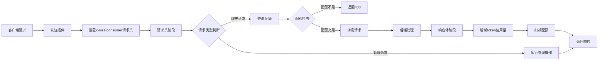
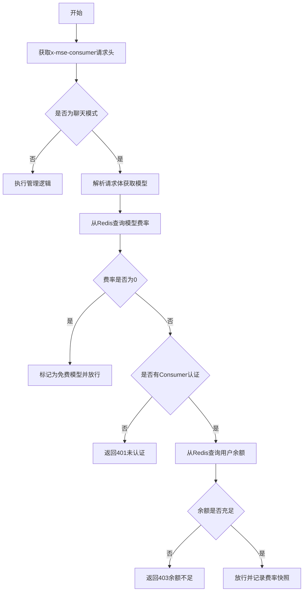
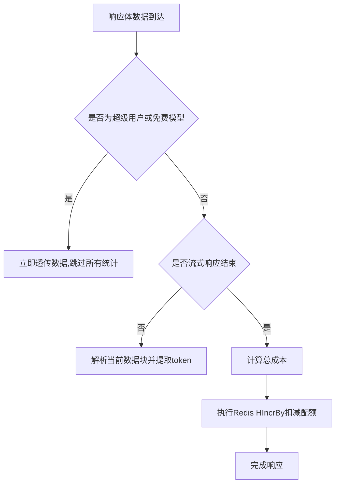

## 功能说明

`ai-quota` 插件实现给特定 consumer 根据分配固定的 quota 进行 quota 策略限流，同时支持 quota 管理能力，包括查询 quota 、刷新 quota、增减 quota。插件支持双重预算管理机制，可同时控制 token 用量和费用上限，支持按模型配置差异化费率。

`ai-quota` 插件需要配合 认证插件比如 `key-auth`、`jwt-auth` 等插件获取认证身份的 consumer 名称，同时需要配合 `ai-statistics` 插件获取 AI Token 统计信息。

## 运行属性

插件执行阶段：`默认阶段`
插件执行优先级：`750`

## 配置说明

| 名称                 | 数据类型            | 填写要求                                 | 默认值 | 描述                                         |
|--------------------|-----------------|--------------------------------------| ---- |--------------------------------------------|
| `redis_key_prefix` | string          |  选填                                     |   chat_quota:   | qutoa redis key 前缀                         |
| `admin_consumer`   | string          | 必填                                   |      | 管理 quota 管理身份的 consumer 名称                 |
| `admin_path`       | string          | 选填                                   |   /quota   | 管理 quota 请求 path 前缀                        |
| `precision`        | int             | 选填                                   |   9   | 金额精度，默认为 9（纳元级别）                         |
| `super_consumers`  | array of string | 选填                                   |   []  | 超级用户列表，超级用户不受配额和费用限制               |
| `redis`            | object          | 是                                    |      | redis相关配置                                  |

`redis`中每一项的配置字段说明

| 配置项       | 类型   | 必填 | 默认值                                                     | 说明                                                                                         |
| ------------ | ------ | ---- | ---------------------------------------------------------- | ---------------------------                                                                  |
| service_name | string | 必填 | -                                                          | redis 服务名称，带服务类型的完整 FQDN 名称，例如 my-redis.dns、redis.my-ns.svc.cluster.local |
| service_port | int    | 否   | 服务类型为固定地址（static service）默认值为80，其他为6379 | 输入redis服务的服务端口                                                                      |
| username     | string | 否   | -                                                          | redis用户名                                                                                  |
| password     | string | 否   | -                                                          | redis密码                                                                                    |
| timeout      | int    | 否   | 1000                                                       | redis连接超时时间，单位毫秒                                                                  |
| database     | int    | 否   | 0                                                          | 使用的数据库id，例如配置为1，对应`SELECT 1`                                                  |


## 配置示例

### 识别请求参数 apikey，进行区别限流，并设置超级用户
```yaml
redis_key_prefix: "chat_quota:"
admin_consumer: consumer3
admin_path: /quota
super_consumers:
  - vip_user_1
  - super_admin
redis:
  service_name: redis-service.default.svc.cluster.local
  service_port: 6379
  password: myredissecret
  timeout: 2000
```


###  超级用户功能

超级用户不受任何配额（token）和费用（cost）限制。

**特性**：
*   **免配额校验**：即使余额为 0 也可以正常使用。
*   **性能优化**：系统会自动跳过超级用户请求在响应阶段的 Token 提取和 Redis 扣费操作，显著降低网关处理延迟。

支持两种配置方式：
1. **静态配置**：在插件配置的 `super_consumers` 列表中添加对应的 consumer 名称。
2. **动态配置**：在 Redis 的 consumer hash 结构中设置 `is_super` 字段为 `"1"`。

**Redis 动态设置示例**:
```bash
# 假设 redis_key_prefix 为 "chat_quota:"
# 将 consumer1 设置为超级用户
HSET chat_quota:consumer1 is_super 1

# 取消 consumer1 的超级用户身份
HDEL chat_quota:consumer1 is_super
```

### 免费模型与零费率机制

当系统识别到一个模型为“免费模型”时，会采取最宽松的准入策略。

**判定标准**：
*   Redis 中未配置该模型的费率 Key。
*   或 Redis 中该模型的费率显式配置为 `{"input_rate":0, "output_rate":0}`。

**免费模型特性**：
*   **支持匿名访问**：访问免费模型时不强制要求 API Key 或 Consumer 认证。
*   **跳过配额检查**：不检查用户的 Token 或金额余额，余额不足也可访问。
*   **完全免扣费**：请求结束后不扣除用户的 Token 配额，不产生费用，且不执行任何 Redis 写入操作。

### 计费基准模型说明 (以输入为准)

为了确保计费的**确定性**与**可预见性**，`ai-quota` 插件采用了“请求侧锁定费率”的机制。

**核心原则**：
*   **以最终请求为准**：计费标准始终基于经过 `smart-router` 或 `model-router` 等插件决策后、即将发往后端的**最终请求模型名**。
*   **抗响应漂移**：大模型供应商在响应中可能会因为负载均衡、版本降级或内部路由返回不同的模型标识。本插件会忽略响应中的模型变化，始终按请求时的费率快照进行结算。

**典型场景示例**：
1.  **智能路由 (Smart Router)**：用户请求模型 `auto`，`smart-router` 根据意图识别将其改写为 `gpt-4`。`ai-quota` 将自动识别出 `gpt-4` 并锁定其费率进行扣费。
2.  **模型降级 (Downgrade)**：用户请求 `gpt-4`，由于后端服务不可用，系统自动降级到 `gpt-3.5` 完成响应。此时计费依然按照用户实际获取到的 `gpt-4` 决策级别进行结算（确保业务逻辑的统一性）。
3.  **模型映射 (Mapping)**：用户请求 `my-custom-model`，通过映射指向 `qwen-max`。计费将以 `qwen-max` 的费率执行。

这种机制有效避免了因后端供应商响应格式不规范或意外的模型切换导致的用户侧计费混乱。

---

###  刷新预算

如果当前请求 url 的后缀符合 admin_path，例如插件在 example.com/v1/chat/completions 这个路由上生效，那么更新预算可以通过
curl https://example.com/v1/chat/completions/quota/refresh -H "Authorization: Bearer credential3" -d "consumer=consumer1&token_budget=10000&cost_budget=100.0"

Redis 中 key 为 chat_quota:token_budget:consumer1 的值就会被刷新为 10000，chat_quota:cost_budget:consumer1 的值会被设置为 100000000000（纳元精度）

### 查询预算

查询特定用户的预算可以通过 curl https://example.com/v1/chat/completions/quota?consumer=consumer1 -H "Authorization: Bearer credential3"
将返回： {"consumer": "consumer1", "token_budget": 10000, "cost_budget": 100.000000000}

### 增减预算

增减特定用户的预算可以通过 curl https://example.com/v1/chat/completions/quota/delta -d "consumer=consumer1&token_budget_delta=100&cost_budget_delta=1.0" -H "Authorization: Bearer credential3"
这样 Redis 中 Key 为 chat_quota:token_budget:consumer1 的值就会增加 100，chat_quota:cost_budget:consumer1 的值就会增加 1000000000（纳元）。可以支持负数，则减去对应值。

### 设置费率

设定模型计费费率可通过
curl https://example.com/v1/chat/completions/quota/setrate -H "Authorization: Bearer credential3" -d "provider=openai&model=gpt-4&input_rate=30.0&output_rate=60.0"

**注意**: 不再支持默认费率配置。必须指定 provider 和 model 进行设置。
费率单位为元/百万token,内部以纳元精度存储

### 查询费率

查询模型费率可通过
curl https://example.com/v1/chat/completions/quota/getrate -H "Authorization: Bearer credential3" -d "provider=openai&model=gpt-4"
将返回： {"provider": "openai", "model": "gpt-4", "input_rate": 30.000000000, "output_rate": 60.000000000}

**注意**: 如果模型费率不存在或被设为 0，将识别为免费模型，不消耗任何配额。

## 设计逻辑

### 架构概述

ai-quota 插件是一个基于 Proxy-WASM 的网关插件，用于对 AI 请求进行配额管理。该插件采用 **请求前检查 + 响应后扣减** 的设计模式，确保每个 consumer 的 token 使用量在配额范围内。

### 整体工作流程



### 请求头阶段处理流程



**关键设计点：**
- **异步查询**：使用 Redis 异步查询，避免阻塞请求处理
- **准入判定下移**：将认证和配额检查推迟到解析出模型费率之后，从而支持免费模型的匿名访问。
- **路径路由**：通过 URL 后缀区分不同操作类型

### 响应体阶段处理流程（聊天请求）



...
